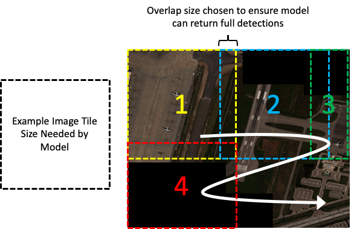

# Guide for Model Developers

## Introduction:

These sections describe how OversightML interacts with containerized computer vision (CV) models that need to process
geospatial imagery. Our approach is to make maximum use of well established open standards, working within the
structures they have defined, to exchange imagery and geospatial features between system components. In particular
this project has adopted [GeoJSON](https://geojson.org/) ([RFC 7946](https://datatracker.ietf.org/doc/html/rfc7946))
as a standard for geospatial features and [GeoTIFF](https://www.ogc.org/standard/geotiff/) or the National Imagery
Transmission Format ([ISO/IEC BIIF Profile JBP-2021.2](https://nsgreg.nga.mil/doc/view?i=5262&month=9&day=23&year=2023))
as the standards for imagery with geospatial metadata. Other common imagery formats, for example PNG
([REC-PNG-20031110](https://www.w3.org/TR/2003/REC-PNG-20031110/)) and JPEG
([ISO/IEC 10918](https://jpeg.org/jpeg/workplan.html)), are also supported for containers that do not make use of
geospatial metadata.

## How OversightML Invokes Your Computer Vision Model:

OversightML is designed to be compatible with SageMaker Hosted Model Endpoints. Instructions on how to build a
compatible container are covered in the [Use Your Own Inference Code With Hosting Services](https://docs.aws.amazon.com/sagemaker/latest/dg/your-algorithms-inference-code.html)
section of the SageMaker documentation. Those containers must implement a REST API that meets the following criteria:

* The model container must have a web server listening on port 8080 and must accept POST requests to the `/invocations` endpoint and GET  requests to the `/ping` endpoint.
* The model container must accept socket connection requests within 250 ms.
* The model container must begin to respond to health checks within 4 minutes after startup. The minimum healthy response is an HTTP 200 status code and an empty body. The request timeout on `/ping` attempts is 2 seconds.
* The model container must respond to `/invocations` requests within 60 seconds. The body of the post request will be an image chip encoded using the format provided along with the request. If successful, the HTTP status code 200 should be used and the response must be a valid GeoJSON document containing detected features. On failure an appropriate 4xx or 5xx status code should be returned.

An example application using FastAPI is shown below:

```python
from fastapi import FastAPI, status, Request, Response

app = FastAPI()

@app.post('/invocations')
async def invocations(request: Request):
    # model() is your function that gets the inference output
    # create_features() is your function that creates a feature collection
    model_resp = await model(Request)
    geojson_resp = await create_features(model_resp)
    response = Response(
        content=geojson_resp,
        status_code=status.HTTP_200_OK,
        media_type="application/geo+json",
    )
    return response

@app.get('/ping')
async def health_check(request: Request):
    return Response(status_code=status.HTTP_200_OK)
```

## The Images OversightML Sends to Your Computer Vision Model:

An OversightML image processing request contains the following parameters that determine what kind of image gets sent to the model container:

* **imageProcessorTileSize**: The maximum dimensions of the image in pixels that should be sent to the model. Note that tiles at the edges of the image may be less than this maximum size.
* **imageProcessorTileOverlap**: The overlap between tiles in pixels
* **imageProcessorTileFormat**: The image format to send to the model. The following options are supported: “NITF”, “JPEG”, “PNG”, “GTIFF”.
* **imageProcessorTileCompression**: The compression method to use which is dependent on the format chosen. For NITF images the valid options are: “J2K”, “JPEG”, and “NONE”. GeoTIFF images support “LZW”, “JPEG”, and “NONE”.



**Figure 1:** Use of tile size and overlap parameters to break a full image into chunks small enough for a CV model.

For images that contain substantial metadata (NITF, SICD) the Model Runner will update any fields necessary to identify
this image as a chip of a larger image and pass along all the other metadata as is. For NITFs that involves adding an
ICHIPB TRE along with updating the IGEOLO field in the image subheader. For SICD the FirstRow/FirstCol and
NumRows/NumCols elements in the ImageData are updated to identify the chip. Passing this robust image metadata along
with each set of pixels allows advanced models to make use of the geospatial context to refine their results.

Note that care must be taken to choose tile size, format, and compression options that will keep the tiles under the
6MB limit imposed by the SageMaker Hosting Real-Time Endpoints. There are many combinations of acceptable values but
common cases are shown below:

| Image Type           | # Bands | Pixel Size | Max Tile Size | Format | Compression | Sample Image Payload Size |
|:---------------------|:-------:|:----------:|:-------------:|:------:|:-----------:|:-------------------------:|
| Panchromatic Imagery |    1    | 11-16 bit  |     2048      |  NITF  |     J2K     |           2.1MB           |
| Pan-sharpened RGB    |    3    |   8-bit    |     4096      |  NITF  |     J2K     |           4.2MB           |
| Pan-sharpened RGB    |    3    |   8-bit    |     2048      | GTIFF  |    NONE     |           4.2MB           |
| RGB PNG              |    3    |   8-bit    |     2048      |  PNG   |   DEFLATE   |           1.8MB           |
| WBID SAR             |    1    |   8-bit    |     4096      |  NITF  |     J2K     |           4.2MB           |
| SICD Int-16          |    2    |   16-bit   |     2048      |  NITF  |     J2K     |           4.3MB           |
| SICD Float-32        |    2    |   32-bit   |      512      |  NITF  |    NONE*    |           2.1MB           |

*NOTE: At the current time the OpenJPEG library used to implement J2K compression does not support floating point
pixels resulting in a much smaller size limit for complex SAR data using a floating point representation.

## What OversightML Expects Your Computer Vision Model to Return:

OversightML has adopted GeoJSON (RFC 7946) as a standard means of exchanging geospatial information so we expect the
computer vision models to return a valid GeoJSON document containing a FeatureCollection where each Feature is a
result on the image.

OversightML expects computer vision models to return results that have not yet been assigned geographic coordinates.
In this case the features returned from the model are “unlocated” and have a null value for the “geometry” property of
the feature (see section 3.2 of RFC 7946). Instead we expect the models to specify the locations of each feature in
pixel coordinates referencing the top left corner of the image chip as 0,0. The GeoJSON specification does not provide
a standard way to capture non-world coordinates so the following convention has been adopted.

Models SHOULD return a imageGeometry key in each feature’s properties. The value of that key will follow the same
structure and coordinate ordering as a GeoJSON Geometry Object (see section 3.1 of RFC 7946) except the values of the
coordinates will not be in WGS-84 they will be in pixels relative to the processed image chip ordered as (x, y). Each
feature MAY choose to return a property value associated with the imageBBox key. In this case the value will be an
array of values consistent with the ordering of the geospatial bbox feature member (see section 5 of RFC 7946) but
instead of longitude, latitude, and optional elevation the values will be in x, y pixels [min x, min y, max x, max y].
Providing support for both of these fields gives model developers the latitude to return everything from a single point
object detection through complex polygons provided by segmentation models. Examples include but are not limited to:

**Example 1:** Single Point location for a detected object with the optional axis aligned bounding box.

```json
"properties": {
    "imageGeometry": {
        "type": "Point",
        "coordinates": [105.0, 5.0]
    },
    "imageBBox": [100, 0, 110, 10],
}
```
**Example 2:** A LineString geometry used to define a simple road segment.

```json
"properties": {
    "imageGeometry": {
        "type": "LineString",
        "coordinates": [[170.0, 45.0], [180.0, 47.0], [182.0, 49.0], ...]
    }
}
```
**Example 3:** A Polygon for a 4-corner building boundary. Note that the first coordinate is repeated to close the exterior boundary of the polygon.

```json
"properties": {
    "imageGeometry": {
        "type": "Polygon",
        "coordinates": [[[0,0], [10,2],[10,12], [0,12], [0,0]]]
    }
}
```
Models SHOULD also return a collection of one or more classes for their features using the featureClasses property.
Each entry in this list should have an Internationalized Resource Identifier (IRI) for the feature class iri and
optionally a score between 0.0 and 1.0 where a 1.0 is the models most confident in the result.

```json
"featureClasses": [{
    "iri": "http://foo.bar/sample/1.0.0/maritime_vessel",
    "score": 0.90
    },{
    "iri": "http://foo.bar/sample/1.0.0/fishing_boat",
    "score": 0.75
}],
```

These are the only non-standard properties required by OversightML. Computer Vision models are free to return other
property values as needed (ex. the modelMetadata property in the example below). They will be passed along unaltered in
the aggregated result but be aware that the size of each feature should be less than 300KB (and ideally much smaller).

These properties were not defined as a “foreign member“, see section 6.1 of RFC 7946, because some GeoJSON
implementations have problems supporting those extensions.  We have found support for arbitrary properties is much
more common and chose to work within the existing constructs.

**Example 4:** A full result containing a single feature with imageGeometry, imageBBox, and featureClasses properties.

```json
{
    "type": "FeatureCollection",
    "features": [{
        "type": "Feature",
        "geometry": null,
        "properties": {
            "imageGeometry": {
                "type": "Point",
                "coordinates": [102.0, 0.5]
            },
            "imageBBox": [100, 0, 104, 1],
            "featureClasses": [{
                "iri": "http://foo.bar/sample/1.0.0/maritime_vessel",
                "score": 0.90
                },{
                "iri": "http://foo.bar/sample/1.0.0/fishing_boat",
                "score": 0.75
              }],
            "modelMetadata": {
                "modelName": "FasterRCNN_ResNet50_FPN_V2",
                "ontologyName": "SampleOntology",
                "ontologyVersion": "1.0.0"
            }
        }
    }]
}
```

**DEPRECATION WARNING:** *The original version of this software allowed models to return image coordinates using a
bounds_imcoords and feature classes using feature_types . Those properties are now deprecated and will likely be
removed in the next major release.*

## The Post Processing OversightML Will Perform on Results

### Compute Geospatial Locations for Features

OversightML will attempt to assign geographic locations to every feature returned by a computer vision model. To do
this it will first update the imageGeometry and imageBBox properties to have values relative to the full image by
adding in the offset of the chip’s upper left corner; (x, y) → (x + ULx, y + ULy). It will then run all of those full
image coordinates through the image_to_world operation on the sensor model defined in the image metadata to create the
WGS-84 coordinates for the geometry and optional bbox members of the feature.

The “type” of the resulting “geometry” member will match the type specified in the imageGeometry property. The decision
about whether the coordinates will have 2D (longitude, latitude) or 3D (longitude, latitude, elevation) values is
dependent on the type of sensor model available with the image metadata. In most cases Model Runner will return 3D
coordinates.

### Add Properties to Capture Information Source

In addition to creating the geometry members OversightML will add property values to help maintain the information
pedigree of each feature. This information is currently grouped under the inferenceMetadata and sourceMetadata
properties but community standards for tracking this information are evolving. WARNING: The names and structure of
these properties has not been finalized and will change in the future.

The `sourceMetadata` property contains a minimal set of values extracted from the metadata associated with each source.
Note that the property itself is a list which will allow us to capture metadata from multiple sources (e.g. an image
and digital terrain data or changes detected between two images). These include:

* **location**: The location where the inference platform used the file for as input to the model.
* **format**: The format of the source information.
* **category**: This field differentiates between EO, FMV, WAMI, SAR, and other potential future source data types.
* **sourceId**: This is an unique identifier can be used to look up original imagery/video from view of authoritative data repository. It is pulled from the image metadata or a duplicate of the location field if the metadata is not available.
* **sourceDT**: The time for when the source was collected. The value will be a ISO 8601 string as defined by RFC 3339 section 5.6.

The `inferenceMetadata` property contains information about the ML job that produced the feature. The specific values include:

* **jobId**: The Job ID is an associated UUID to verify which inference job the detection came from to track inference outputs.
* **inferenceDT**: The time at which the model ran on the image and generated the features. The value will be a ISO 8601 string as defined by RFC 3339 section 5.6.

**Example 5:** Full result shown above including the additions made by post processing:

```json
{
    "type": "FeatureCollection",
    "features": [{
        "type": "Feature",
        "geometry": {
        "type": "Point",
          "coordinates": [32.123456, 18.123456, 42.0]
        },
        "bbox": [32.123450, 18.123450, 42.0, 32.123460, 18.123460, 42.0],
        "properties": {
            "imageGeometry": {
                "type": "Point",
                "coordinates": [102.0, 0.5]
            },
            "imageBBox": [100, 0, 104, 1],
            "featureClasses": [{
                "iri": "http://foo.bar/sample/1.0.0/maritime_vessel",
                "score": 0.90
                },{
                "iri": "http://foo.bar/sample/1.0.0/fishing_boat",
                "score": 0.75
              }],
            "modelMetadata": {
                "modelName": "FasterRCNN_ResNet50_FPN_V2",
                "ontologyName": "SampleOntology",
                "ontologyVersion": "1.0.0"
            },
            "sourceMetadata": [{
                "location": "s3://bucket-name/sample-image.NTF",
                "format": "NITF",
                "category": "EO",
                "sourceId": "20230101-sample-ID",
                "sourceDT": "2023-01-01T05:48:13Z"
            }],
            "inferenceMetadata": {
                "jobId": "dbc68a2c-2ddf-45a4-9910-ef3a34ed00c1",
                "inferenceDT": "2023-01-01T05:49:00Z"
            }
        }
    }]
}
```

### Aggregate Features on Tile Boundaries

The image processing request allows the requestor to select how OversightML handles features that were clipped at tile
boundaries. At this time the options are:

* **NONE**: No additional processing is performed.
* **NMS**: A Non-Maximal Suppression algorithm is run that will drop features that overlap results from other tiles.
* **SOFT-NMS**: An algorithm that decays the detection scores of duplicate objects instead of dropping them from the result set.

For the soft-NMS the detection scores of the features are not overwritten but instead the class scores are updated
and a new property rawScore is added to track the original value.

```json
"featureClasses": [{
    "iri": "http://foo.bar/sample/1.0.0/maritime_vessel",
    "score": 0.40,
    "rawScore": 0.90
    },{
    "iri": "http://foo.bar/sample/1.0.0/fishing_boat",
    "score": 0.35,
    "rawScore": 0.75
}]
```
