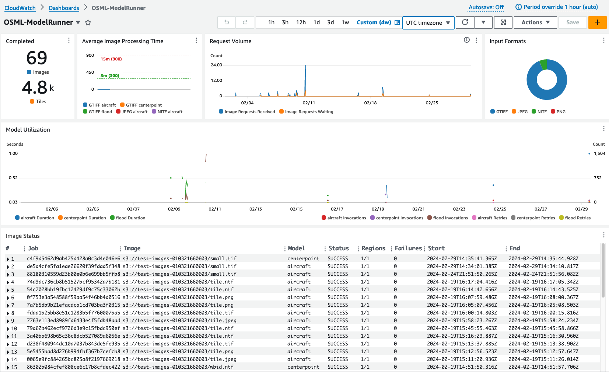

# Metrics and Dashboards

## Metrics

The OversightML ModelRunner application outputs custom [CloudWatch](https://aws.amazon.com/cloudwatch/) metrics using
the `OSML/ModelRunner` [Namespace](https://docs.aws.amazon.com/AmazonCloudWatch/latest/monitoring/cloudwatch_concepts.html#Namespace).
The application outputs common metrics to capture the processing time, invocation counts, and errors.

| Namespace        |   Metric    | Notes                                                 |
|:-----------------|:-----------:|:------------------------------------------------------|
| OSML/ModelRunner |  Duration   | End to end time for the overall operation to complete |
|                  | Invocations | Number of times the operation is executed             |
|                  |   Errors    | Number of times the operation failed                  |
|                  |  Throttles  | Number of times the operation had to wait             |
|                  |   Retries   | Number of times the operation had to be retried       |

These metrics are emitted for different portions of each image processing job and we expect those
timelines to be heavily influenced by details of the imagery and computer vision models provided with each request.
We are using [CloudWatch Dimensions](https://docs.aws.amazon.com/AmazonCloudWatch/latest/monitoring/cloudwatch_concepts.html#Dimension)
to provide more detailed context for each metric value.

| Dimension   |                      Sample Values                      | Notes                                                                                                                                                                                                                            |
|:------------|:-------------------------------------------------------:|:---------------------------------------------------------------------------------------------------------------------------------------------------------------------------------------------------------------------------------|
| Operation   | ImageProcessing, RegionProcessing, TileGeneration, ...  | This will let us track latency, errors, etc. for various subsections of the dataflow. For now this will primairly decompose to the image, region, and tile distributed computing but it can be expanded in the future as needed. |
| ModelName   | maritime-vessel-detector, urban-building-extractor, ... | The overall time to process an image is highly dependent on the model complexity and endpoint configuration. This dimension allows us to break out metrics on a per model basis.                                                 |
| InputFormat |                       NITF, TIFF                        | The format of the input image is another factor that can greatly impact processing time since it drives our IO and tile cutting timelines.                                                                                       |

CloudWatch will treat each permutation of Namespace, Metric, and Dimensions as a unique identifier for a series of
related data points. The Operation dimension is always present and it defines the portion of the image processing job
described by the metric. The following diagram shows the relationship between the various metered ModelRunner Operations
running on a distributed system.


## Dashboards

These metrics can be combined with metrics from other AWS services to build dashboards to monitor imagery processed
by the system. The choice of what to monitor is up to you but the following example demonstrates several common examples.
Note that all these widgets are sensitive to the CloudWatch Dashboard time range which will allow you to easily analyze
ongoing and historical system performance.



### Completed Counts
This widget displays the number of images and tiles processed in the selected time range. It is a single value metric
that displays the number of times the ImageProcessing and TileProcessing operations were invoked.
```json
{
    "metrics": [
        [ { "label": "Images", "expression": "SUM(SEARCH('{OSML/ModelRunner, InputFormat, ModelName, Operation} ImageProcessing Invocations', 'Sum'))", "region": "us-west-2", "period": 3600 } ],
        [ { "label": "Tiles", "expression": "SUM(SEARCH('{OSML/ModelRunner, ModelName, Operation} TileProcessing Invocations', 'Sum'))", "region": "us-west-2", "period": 3600 } ]
    ],
    "view": "singleValue",
    "title": "Completed",
    "region": "us-west-2",
    "sparkline": false,
    "period": 3600,
    "stat": "Average",
    "setPeriodToTimeRange": true,
    "trend": false
}
```

### Average Image Processing Time
This widget displays the average time required to process images. Each model / format pair is displayed independently
since both factors can have a large impact on processing time.

```json
{
    "metrics": [
        [ { "expression": "SEARCH('{OSML/ModelRunner, InputFormat, ModelName, Operation} ImageProcessing Duration', 'Average')", "region": "us-west-2", "period": 3600 } ]
    ],
    "view": "bar",
    "title": "Average Image Processing Time",
    "region": "us-west-2",
    "annotations": {
        "horizontal": [
            {
                "color": "#2ca02c",
                "label": "5m",
                "value": 300,
                "yAxis": "left"
            },
            {
                "color": "#d62728",
                "label": "15m",
                "value": 900,
                "yAxis": "left"
            }
        ]
    },
    "stat": "Average",
    "period": 3600
}
```

### Request Volume
This widget displays the number of image processing requests received and how many are waiting in the queue. Note that
this information comes from metrics already available through SQS.
```json
{
    "view": "timeSeries",
    "title": "Request Volume",
    "region": "us-west-2",
    "stacked": false,
    "metrics": [
        [ "AWS/SQS", "NumberOfMessagesReceived", "QueueName", "ImageRequestQueue", { "label": "Image Requests Received", "stat": "Sum", "region": "us-west-2" } ],
        [ ".", "ApproximateNumberOfMessagesVisible", ".", ".", { "label": "Image Requests Waiting", "stat": "Sum", "region": "us-west-2" } ]
    ],
    "stat": "Sum",
    "period": 300
}
```

### Input Formats
This widget displays the number of tiles processed for each image format.

```json
{
    "view": "pie",
    "title": "Input Formats",
    "region": "us-west-2",
    "metrics": [
        [ { "expression": "SEARCH('{OSML/ModelRunner, InputFormat, Operation}  TileGeneration Invocations', 'Sum')", "region": "us-west-2" } ]
    ],
    "stat": "Average",
    "period": 300,
    "setPeriodToTimeRange": true,
    "sparkline": false,
    "trend": false
}
```

### Model Utilization
This widget displays the average time it takes for a model endpoint to process an image tile along with counts of the
total number of invocations, errors, and retries. Different trendlines are provided for each model allowing you to assess
their performance independently.
```json
{
    "view": "timeSeries",
    "title": "Model Utilization",
    "region": "us-west-2",
    "stacked": false,
    "metrics": [
        [ { "expression": "SEARCH('{OSML/ModelRunner, ModelName, Operation} ModelInvocation Duration', 'Average', 60)", "region": "us-west-2" } ],
        [ { "expression": "SEARCH('{OSML/ModelRunner, ModelName, Operation} ModelInvocation Invocations', 'Sum', 60)", "yAxis": "right", "region": "us-west-2" } ],
        [ { "expression": "SEARCH('{OSML/ModelRunner, ModelName, Operation} ModelInvocation Errors', 'Sum', 60)", "yAxis": "right", "region": "us-west-2" } ],
        [ { "expression": "SEARCH('{OSML/ModelRunner, ModelName, Operation} ModelInvocation Retries', 'Sum', 60)", "yAxis": "right", "region": "us-west-2" } ]
    ],
    "yAxis": {
        "right": {
            "showUnits": false,
            "label": "Count"
        },
        "left": {
            "showUnits": false,
            "label": "Seconds"
        }
    },
    "stat": "Average",
    "period": 300
}
```

### Image Status
This widget takes advantage of CloudWatch's ability to dynamically parse and display information from the application
logs. In this case the success or failure status logs are parsed from the structured logging output to the
/aws/OSML/MRService log group and key fields are displayed in a tabular format to provide operators with individual
results of an image processing job.

```text
fields job_id as Job, request.image_url as Image, request.model_name as Model, status as Status,
|   concat(request.region_success, "/", request.region_count) as Regions, request.region_error as Failures,
|   fromMillis(request.start_time) as Start, fromMillis(request.end_time) as End
| filter message = "StatusMonitorUpdate" and status in ["SUCCESS", "FAILED"]
| sort @timestamp desc
| limit 50
```
